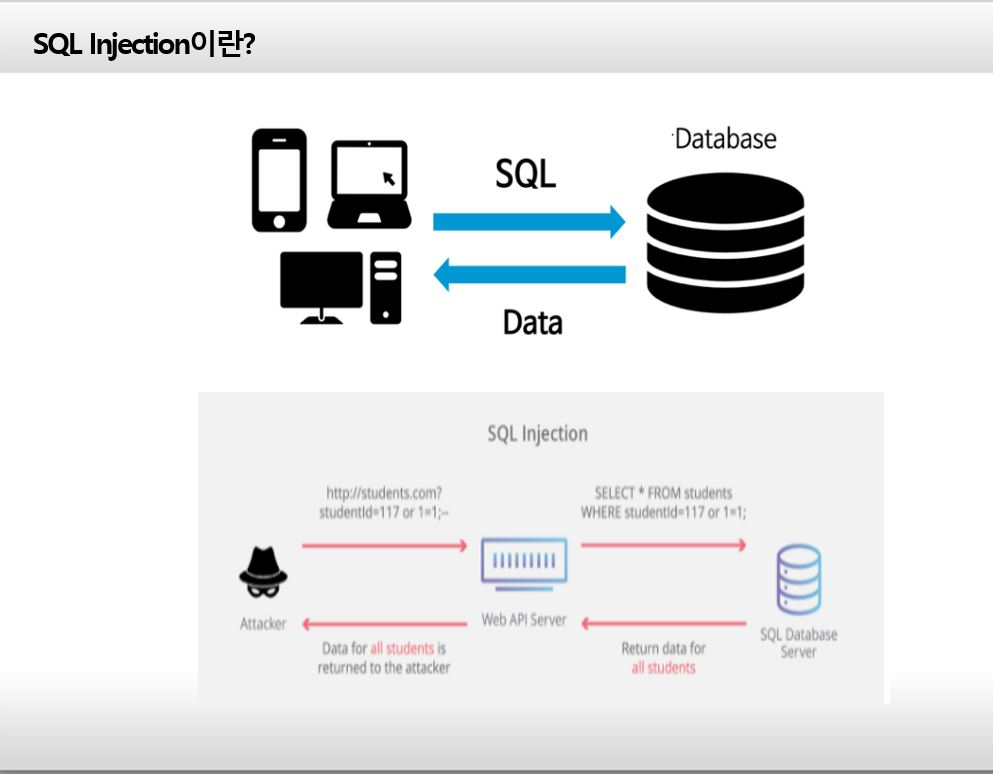
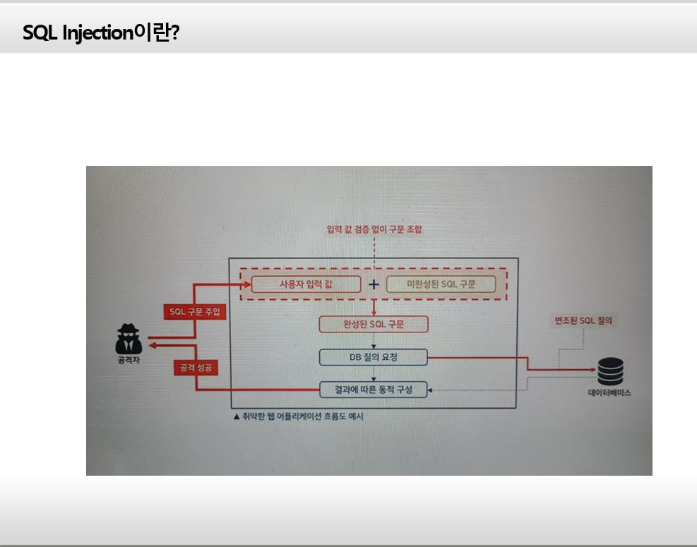
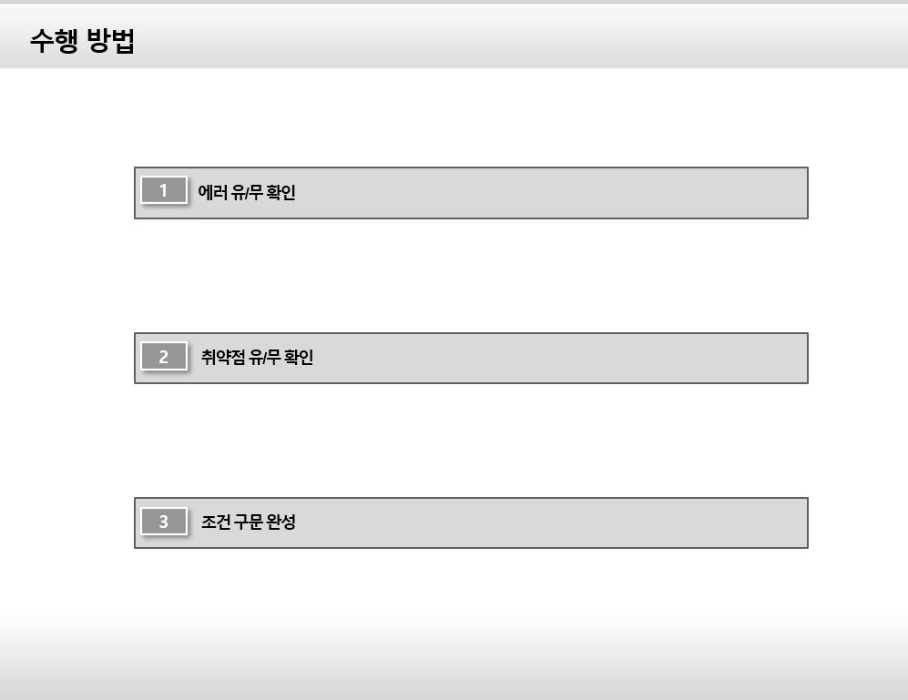
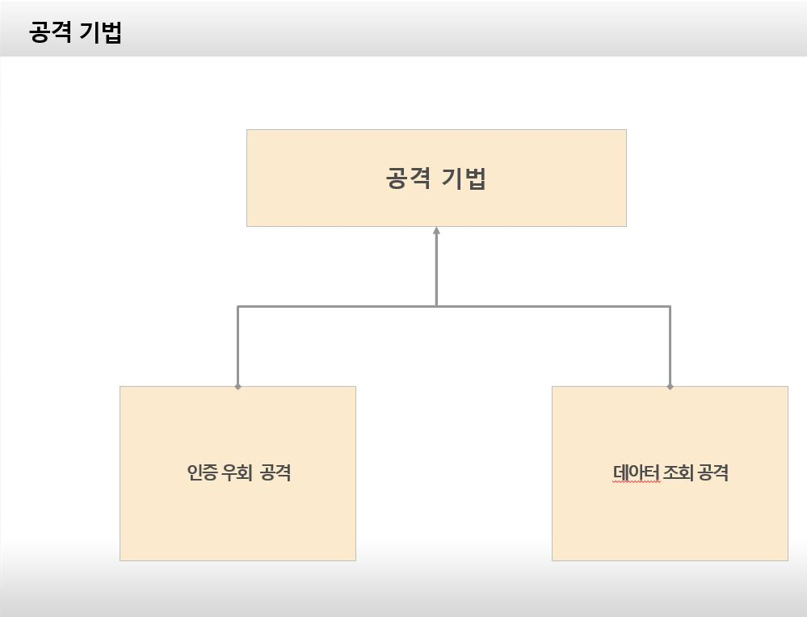
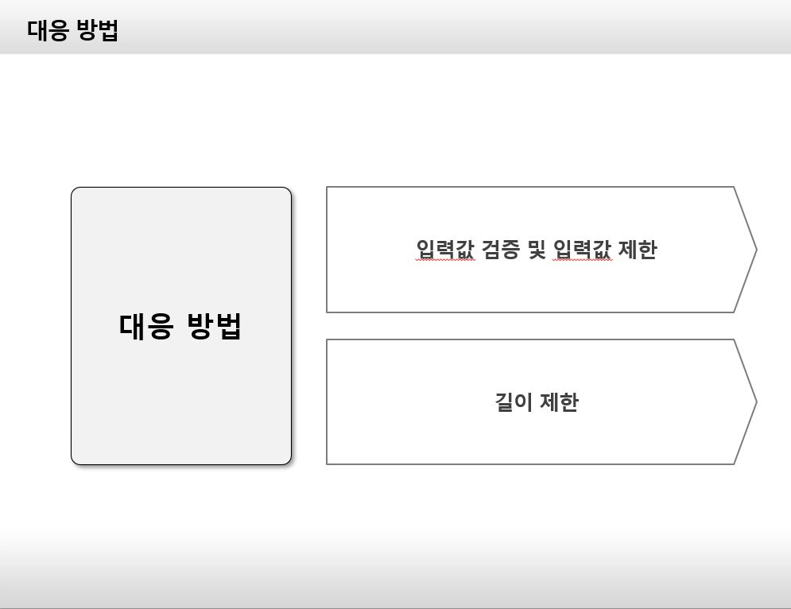

# SQL-Injection-presentation

## -목차-
&nbsp;&nbsp;1.  [SQL Injection이란?](https://github.com/diqksrk/SQL-Injection-presentation#1-SQL-Injection이란?) 
 
&nbsp;&nbsp;2.  [SQL Injection 수행방법](https://github.com/diqksrk/opensource-10#2-개발자를-위한-사양-설명서) 
 
&nbsp;&nbsp;3.  [SQL Injection 공격기법](https://github.com/diqksrk/opensource-10#3-개발-참여-방법-안내) 
 
&nbsp;&nbsp;4.  [SQL Injection 대응방법 : 시큐어 코딩](https://github.com/diqksrk/opensource-10#4-적용-라이센스) 
 
&nbsp;&nbsp;5.  [발표 영상](https://github.com/diqksrk/opensource-10#4-적용-라이센스) 
 
## 1. SQL Injection이란?

## 2. SQL Injection 수행방법

## 3. SQL Injection 공격기법

  
## 4. SQL Injection 대응방법 : 시큐어 코딩

## 5. 발표 영상

